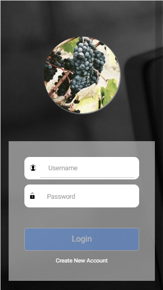
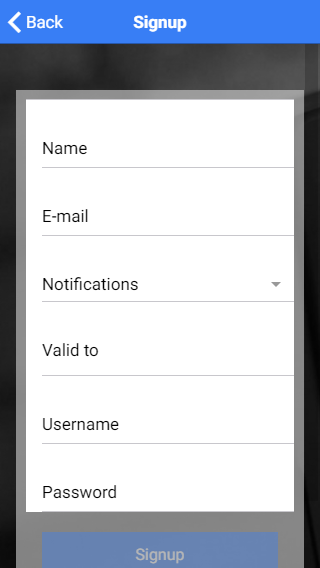
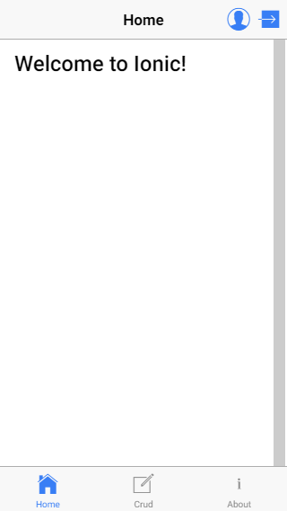
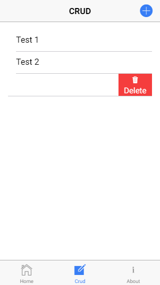
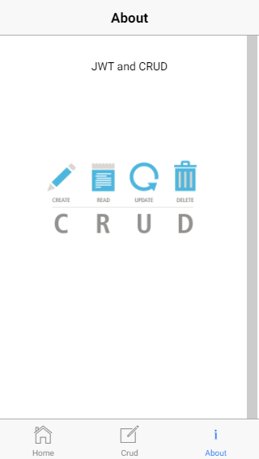

#Spring-Boot + Ionic 3 + JWT + CRUD

This project is a simple application using Ionic on the frontend and Spring Boot at the backend.

##Stack
* Java 8
* Node
* Spring-Boot 1.5.3
* Ionic 3
* JWT
* Maven

##Screenshots

